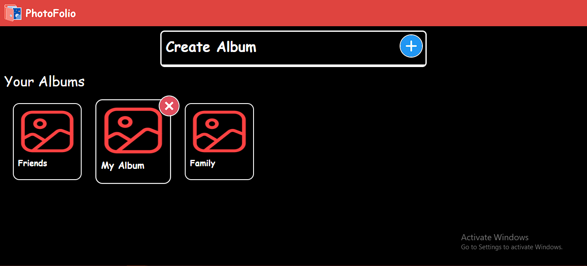
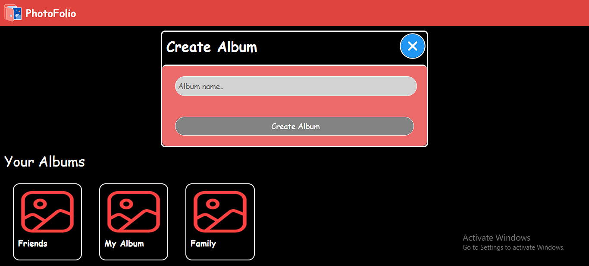
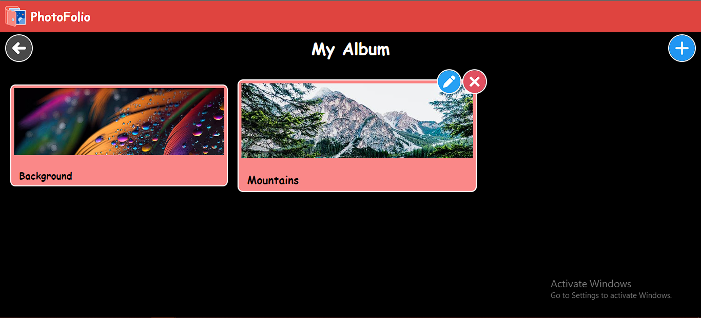
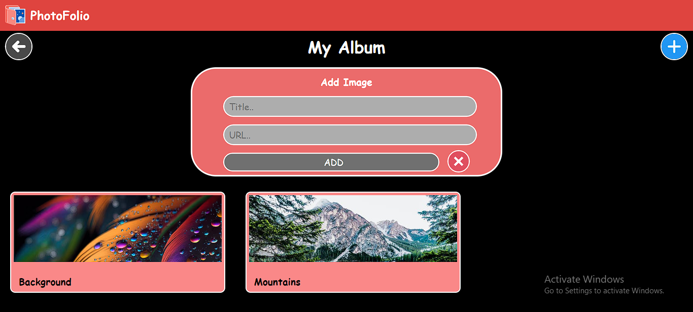
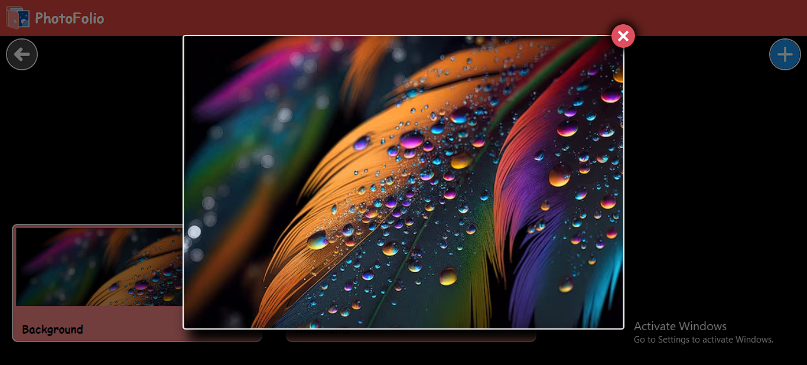

# PhotoFolio - Your Photo Album App

PhotoFolio is a simple web application built with React and Firebase that allows you to create and manage photo albums. It's a great way to organize and showcase your favorite photos!

## Features

- Create and manage photo albums.
- Add, view, and delete photos within each album.
- Responsive design for seamless browsing on various devices.
- Real-time updates with Firebase.
- User-friendly interface.


## Technologies Used

PhotoFolio is built using the following technologies:

- **React**: A JavaScript library for building user interfaces.
- **Firebase**: A backend-as-a-service platform for real-time database and user authentication.
- **Toastr**: JavaScript notifications library used to provide user-friendly notifications.
- **Node.js**: The JavaScript runtime that allows you to run the project and manage dependencies.


## Getting Started

Follow these instructions to get a copy of the project up and running on your local machine.


### Prerequisites

- Node.js.


### Installation

1. Clone the repository to your local machine:

   ```bash
   git clone https://github.com/KKBhati07/PhotoFolio.git

2. Install the project dependencies:
    ```bash
    npm install


### Usage

1. Start the development server:
    ```bash
    npm start


## Screenshots






